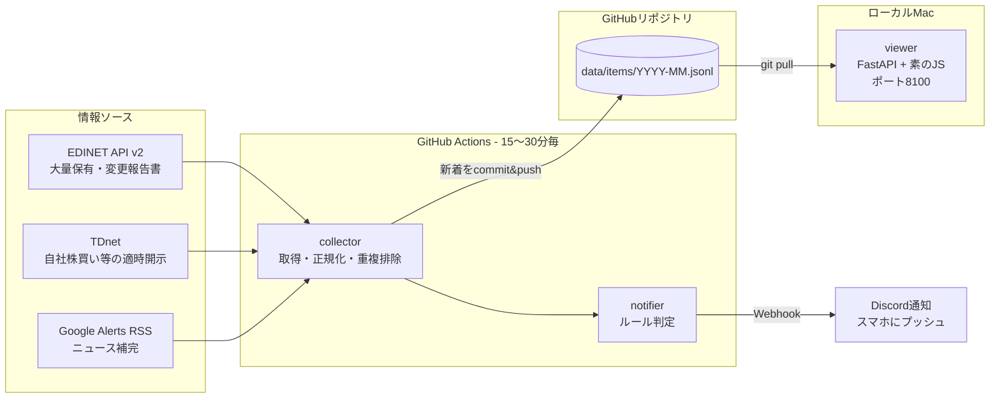

# disclosure_radar 設計書

需給に直結する開示情報(大量保有報告書・自社株買い等)を24時間自動収集し、
タイムライン表示とDiscord通知を行う個人用システム。

- 作成日: 2026-07-10
- ステータス: 設計段階(未実装)

---

## 1. 目的・背景

トレード判断に使う「大口の痕跡」— 大量保有報告書(5%ルール)、変更報告書、
自社株買いなどの需給インパクトが大きい開示 — を、寝ている間も自動で収集・通知する。

当初はGoogle Alerts + RSSリーダー + IFTTT/Zapier + LINE通知の構成を検討したが、
以下の理由で自作システム中心の構成に決定した:

| 当初案の課題 | 対応 |
|---|---|
| LINE Notifyが2025年3月に終了、IFTTT→LINEの定番経路が消滅 | 通知はDiscord Webhookに変更 |
| Zapier/IFTTTの無料枠が縮小(月100タスク等)、開示件数に耐えない | 通知処理を自作(件数制限なし) |
| Google Alertsは報道ベースで遅い・取りこぼす | 一次ソース(EDINET API・TDnet)を直接取得。Google Alertsは補助ソースとして併用 |
| Feedly等は既読管理・フィルタが汎用的すぎる | 自作タイムラインUI(銘柄コード・カテゴリでフィルタ) |

## 2. 全体アーキテクチャ

収集・通知は**GitHub Actions(クラウド)**で定期実行し、Macがスリープ中でも動く。
閲覧UIは**ローカルのFastAPI**で、起動時にリポジトリをpullして最新データを表示する。



**データの真実はリポジトリにcommitされるJSONL**(いわゆるgit scraping方式)。
DBサーバー不要・履歴が全部gitに残る・MacとActionsのデータ同期がgit pullで済む。

## 3. 情報ソース

### 3.1 EDINET API v2(一次ソース・最重要)

- 書類一覧API: `https://api.edinet-fsa.go.jp/api/v2/documents.json?date=YYYY-MM-DD&type=2`
- 認証: `Subscription-Key`(EDINETアカウント登録で無料発行)。ローカルは`.env`、Actionsはリポジトリsecretに置く
- 抽出対象: **府令コード(ordinanceCode)= 060(大量保有府令)** で絞り、
  大量保有報告書・変更報告書・訂正報告書をまとめて拾う
  (docTypeCode 350=大量保有報告書。変更報告書・訂正の正確なコードは実装時に
  [EDINET API仕様書](https://disclosure2dl.edinet-fsa.go.jp/guide/static/disclosure/download/ESE140206.pdf)の別紙で確定する)
- 取得できる構造化フィールド: 提出者名(=買った大口の名前)、対象発行会社・銘柄コード、提出日時
- 将来拡張: 書類取得APIでXBRLを取り、保有割合の増減・共同保有者までパースする(フェーズ4)

### 3.2 TDnet(一次ソース)

- JPX公式APIは有料のため、非公式の[やのしんTDnet WEB-API](https://webapi.yanoshin.jp/tdnet/)を使う
  - 例: `https://webapi.yanoshin.jp/webapi/tdnet/list/recent.json`(数分毎にTDnetと同期、RSS/JSON/XML対応)
- 抽出対象(表題のキーワードマッチ):
  - `自己株式の取得`(自社株買い決議)
  - `自己株式立会外買付取引`(ToSTNeT-3)
  - `公開買付`(TOB)
  - キーワードは設定ファイル`config/sources.yml`で追加・変更可能
- **リスク**: 非公式APIのため停止リスクあり。アダプタ層を挟み、止まったら
  TDnet閲覧サービスの直接スクレイピングに差し替えられる構造にする(§10)

### 3.3 Google Alerts RSS(補助ソース)

- ユーザーがGoogle Alertsで「大量保有報告書」「自社株買い」「5%ルール」等を登録し、
  配信先を「RSSフィード」に設定 → 発行されたフィードURLを`config/sources.yml`に貼る
- collectorが他ソースと同じ形式に正規化して取り込む(feedparserを使用)
- 位置づけ: EDINET/TDnetに載らない周辺情報(観測記事・思惑報道)の補完。一次ソースより遅い前提

## 4. データ設計

### 4.1 アイテム共通スキーマ

全ソースを以下の1レコード形式に正規化する:

```json
{
  "id": "edinet:S100XXXX",
  "source": "edinet",
  "category": "large_holding",
  "title": "大量保有報告書(株式会社◯◯)",
  "url": "https://disclosure2.edinet-fsa.go.jp/...",
  "code": "7203",
  "company": "トヨタ自動車",
  "filer": "◯◯アセットマネジメント",
  "published_at": "2026-07-10T15:32:00+09:00",
  "collected_at": "2026-07-10T15:45:12+09:00",
  "tags": ["大量保有"],
  "raw": {}
}
```

- `id`: ソース + ソース内一意キー(EDINETはdocID、TDnetは開示ID、RSSはURLのハッシュ)。**重複排除のキー**
- `category`: `large_holding` / `change_report` / `buyback` / `tob` / `news`
- `code` / `filer`: EDINET・TDnetでは構造化データから取得。newsはnull可
- `raw`: ソース固有の生フィールドを保持(後からのパース強化用)

### 4.2 保存形式

- `data/items/YYYY-MM.jsonl` — 月ごとに1ファイル、1行1アイテム、追記のみ
- collectorは「既存JSONLに無いidだけ」を追記 → これが重複排除と「新着」判定を兼ねる
- viewerは起動時にJSONLを読み込みローカルSQLiteに展開(既読フラグ等のローカル状態もSQLite側に持つ)

## 5. 収集パイプライン(GitHub Actions)

### 5.1 ワークフロー

`.github/workflows/collect.yml`:

1. checkout(データブランチ=masterごとpull)
2. Python環境セットアップ + 依存インストール
3. `python -m collector.run` — 全ソース取得 → 正規化 → 新着抽出 → JSONL追記 → 通知判定・Discord送信
4. 変更があれば `data/` をcommit & push(コミットメッセージ: `収集: 新着N件 (YYYY-MM-DD HH:MM)`)
5. `concurrency`設定で多重実行を防止

### 5.2 実行スケジュール

開示の実態に合わせてメリハリをつける(大量保有報告書は平日15時以降に集中提出):

| 時間帯(JST) | 間隔 | ねらい |
|---|---|---|
| 平日 8:00〜19:00 | 20分毎 | EDINET・TDnetの開示時間帯 |
| 上記以外(夜間・休日) | 60分毎 | Google Alerts経由の海外時間ニュース拾い |

- private repoの無料枠は月2,000分。上記設定で1回1〜2分 × 月900回 ≒ 上限内に収まる想定。
  超過しそうなら間隔を広げるか、公開情報のみ扱うリポジトリなのでpublic化(枠無制限)も選択肢
- **GitHub Actionsのcronは数分〜数十分遅延することがある**。本システムの速報性は
  「最大30分程度の遅れは許容」という前提で設計する(それでも翌朝発見よりはるかに速い)

### 5.3 ローカルフォールバック

collectorはMacでも `python -m collector.run` でそのまま動くようにする
(Actions障害時・過去日の一括取り込み・デバッグ用)。このため**コードは全てPython 3.7互換**で書く
(ActionsのPythonは3.11等でよいが、構文は3.7に合わせる。ウォルラス演算子等は使わない)。

## 6. 通知設計(Discord)

- 通知先: 自分専用Discordサーバーのチャンネル + **Webhook URL**(Actionsのsecret `DISCORD_WEBHOOK_URL`)
- スマホのDiscordアプリでプッシュ受信 → 「寝ている間もLINEのように通知」の要件を満たす

### 6.1 通知ルール(`config/rules.yml`)

```yaml
rules:
  - name: 大量保有・変更報告書は全部通知
    match: { category: [large_holding, change_report] }
    channel: default
  - name: 自社株買い・TOBは全部通知
    match: { category: [buyback, tob] }
    channel: default
  - name: ニュースは「大量保有」を含むものだけ
    match: { category: [news], title_contains: ["大量保有"] }
    channel: default
```

- ルールは宣言的に書き、collectorが新着アイテムに対して評価する
- 通知フォーマット(Discord embed): カテゴリ絵文字 + 銘柄コード・社名 + 表題 + 提出者 + 原文リンク
  - 例: `🐋 [7203] トヨタ自動車 | 大量保有報告書 | 提出者: ◯◯アセット | 15:32`
- 大量新着時(初回実行・障害復旧後)は最大10件+「他N件」に丸めて通知爆発を防ぐ
- 通知済み管理は不要(「JSONLに無かった=新着」の1回だけ通知する仕組みのため)

## 7. 閲覧UI(ローカル)

- 構成: FastAPI + 素のJS(trade_dashboardと同じ流儀)、**ポート8100**(8000はtrade_dashboardが使用中)
- 起動: `.venv/bin/python -m uvicorn viewer.main:app --port 8100`
- 起動時と「更新」ボタンで `git pull` → JSONL再読み込み

### 7.1 画面構成(1画面)

- **タイムライン**: 新着順の縦一列(ニュースアプリ風)。カテゴリ別の色バッジ(🐋大量保有 / 🔄変更 / 💰自社株買い / 📰ニュース)
- **フィルタバー**: カテゴリ / 銘柄コード / キーワード / 期間
- **既読管理**: クリックで既読(グレーアウト)。未読件数をヘッダーに表示。既読状態はローカルSQLiteのみ(commitしない)
- 各行から原文(EDINET/TDnet/記事)へワンクリックで飛べる

### 7.2 API

| エンドポイント | 内容 |
|---|---|
| `GET /api/items?category=&code=&q=&since=&until=` | タイムライン取得(ページング付き) |
| `POST /api/items/{id}/read` | 既読化 |
| `POST /api/refresh` | git pull + 再読み込み |

## 8. リポジトリ構成

```
disclosure_radar/
├── CLAUDE.md               # 開発上の約束事(trade_dashboardに準ずる)
├── docs/DESIGN.md          # 本書
├── config/
│   ├── sources.yml         # Google AlertsフィードURL・TDnetキーワード等
│   └── rules.yml           # 通知ルール
├── collector/
│   ├── run.py              # エントリポイント(取得→正規化→追記→通知)
│   ├── sources/
│   │   ├── edinet.py       # EDINET API v2アダプタ
│   │   ├── tdnet.py        # やのしんWEB-APIアダプタ(差し替え可能な構造)
│   │   └── google_alerts.py
│   ├── normalize.py        # 共通スキーマへの正規化・重複排除
│   └── notify.py           # ルール評価 + Discord Webhook送信
├── viewer/
│   ├── main.py             # FastAPIアプリ
│   └── static/             # index.html / app.js / style.css
├── data/items/             # YYYY-MM.jsonl(collectorがcommit)
├── .github/workflows/collect.yml
├── .env.example            # EDINET_API_KEY / DISCORD_WEBHOOK_URL
└── requirements.txt        # requests, feedparser, pyyaml, fastapi, uvicorn
```

## 9. 秘匿情報の扱い

| 情報 | ローカル | GitHub Actions |
|---|---|---|
| EDINET APIキー | `.env`(gitignore) | リポジトリsecret `EDINET_API_KEY` |
| Discord Webhook URL | `.env`(gitignore) | リポジトリsecret `DISCORD_WEBHOOK_URL` |

- 扱うデータ自体は全て公開開示情報のため、data/のcommitに機密性の問題はない
- リポジトリをpublic化する場合もsecretは露出しない(ワークフローログへの出力に注意)

## 10. 制約・リスクと対策

| リスク | 影響 | 対策 |
|---|---|---|
| やのしんAPI(非公式)の停止 | TDnet系が取れなくなる | アダプタ層で分離。停止時はTDnet閲覧サービスの直接スクレイピングに実装差し替え。取得失敗が続いたらDiscordに運用アラートを送る |
| GitHub Actions cronの遅延 | 通知が最大30分程度遅れる | 許容する設計(§5.2)。将来より高頻度が欲しくなったらMac常時稼働 or 有料の軽量VMに移す |
| Actions無料枠(private月2,000分)超過 | 月末に収集停止 | 実行間隔で調整。public化も選択肢 |
| Google Alertsのフィード仕様変更・取りこぼし | ニュース補完の欠落 | 補助ソースの位置づけなので致命的でない。一次ソースはEDINET/TDnet |
| EDINET APIのメンテナンス・仕様改訂 | 収集の一時停止 | 取得失敗の連続をDiscordにアラート。JSONLは追記式なので復旧後に過去日の穴埋め再取得が可能 |
| ローカルPython 3.7.3制約 | 新しい構文・ライブラリが使えない | 全コード3.7互換で統一(§5.3)。依存は requests / feedparser / pyyaml / fastapi の枯れた版に固定 |

## 11. 実装フェーズ

| フェーズ | 内容 | 完了条件 |
|---|---|---|
| **1. コア** | EDINET収集 + JSONL保存 + Discord通知をActionsで稼働 | 平日夕方、大量保有報告書の通知がスマホに届く |
| **2. 閲覧UI** | FastAPIタイムライン(フィルタ・既読) | 朝起きて夜間の新着を一覧で振り返れる |
| **3. ソース拡充** | TDnet(自社株買い・TOB) + Google Alerts RSS取り込み | 通知ルールがカテゴリ別に効いている |
| **4. 深掘り** | 大量保有報告書のXBRLパース(提出者・保有割合の増減)、trade_dashboardウォッチリストとの連動(ウォッチ銘柄だけ強調通知) | 「誰が・何%→何%に」まで通知に載る |

フェーズ1が最小価値(寝ている間の自動収集+通知)。ここまで最短で作って運用を始め、
使い勝手を見てから2以降を進める。

## 12. 未決事項

- 変更報告書・訂正報告書の正確なdocTypeCode/formCode(実装時にEDINET API仕様書別紙で確定)
- リポジトリをprivateにするかpublicにするか(Actions枠の消費具合を見て判断)
- Discordのチャンネル分割(カテゴリ別に分けるか、1チャンネルに流すか)— まず1チャンネルで開始
- フェーズ4のウォッチリスト連動方式(trade_dashboardのDB参照 or ウォッチリストのエクスポート)
